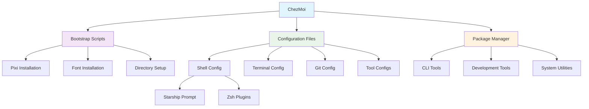

# Project Overview

## What This Project Does

This ChezMoi dotfiles repository creates a complete, reproducible development environment that can be deployed to any machine with a single command. It combines modern CLI tools, terminal configuration, and shell enhancements into a unified system.

## Architecture

### 🏗️ Core Components

```
ChezMoi (Dotfile Manager)
├── Configuration Management (dot_* files)
├── Bootstrap Scripts (run_once_* files)
├── Package Management (pixi.toml)
└── Documentation (docs/, README files)
```

### 🔄 Component Relationships



## Technology Stack

### 🎯 Primary Tools
| Component | Technology | Purpose |
|-----------|------------|---------|
| **Dotfile Manager** | ChezMoi | Declarative config management with templating |
| **Package Manager** | Pixi | CLI tool management via conda-forge |
| **Terminal** | WezTerm | GPU-accelerated terminal with Lua config |
| **Shell** | Zsh + Zinit | Modern shell with fast plugin loading |
| **Prompt** | Starship | Cross-shell prompt with git integration |

### 🔧 Supporting Tools
| Category | Tools | Replaces |
|----------|-------|----------|
| **File Operations** | eza, bat, fd, ripgrep | ls, cat, find, grep |
| **System Monitoring** | btop, dust, duf | top, du, df |
| **Development** | git-delta, gh, just | basic git, make |
| **Navigation** | zoxide, fzf | cd, manual search |
| **Data Processing** | jq, qsv, xsv | manual parsing |

## Key Benefits

### ✨ For Users
- **One-Command Setup** - Fresh machine ready in minutes
- **Consistent Environment** - Same tools and configs everywhere
- **Modern Tooling** - Fast, feature-rich CLI tools
- **Self-Documenting** - Comprehensive inline documentation

### 🛠️ For Maintainers
- **Modular Design** - Easy to add/remove components
- **Version Controlled** - All changes tracked and reversible
- **Template Support** - Dynamic configs based on environment
- **Extensible** - Clean architecture for additions

## Workflow

### 🚀 Initial Setup
1. **Install ChezMoi** - Download and initialize
2. **Clone Repository** - Pull dotfiles configuration
3. **Run Bootstrap** - Execute one-time setup scripts
4. **Apply Configuration** - Deploy all dotfiles

### 🔄 Daily Usage
1. **Edit Source** - Modify configs in ChezMoi source
2. **Preview Changes** - Use `chezmoi diff` to review
3. **Apply Updates** - Deploy with `chezmoi apply`
4. **Sync Repository** - Commit and push changes

### 📦 Adding Tools
1. **Update pixi.toml** - Add new dependencies
2. **Create Config** - Add tool-specific configuration
3. **Update Aliases** - Add convenient shortcuts
4. **Test Integration** - Verify everything works together

## Directory Philosophy

### 📁 Organization Principles
- **XDG Compliance** - Follow Linux standards for config placement
- **Modular Structure** - Separate concerns into distinct files
- **Clear Naming** - Descriptive names that indicate purpose
- **Documentation** - README files in major directories

### 🗂️ File Categories
- **dot_*** - Files that go to home directory (ChezMoi convention)
- **run_once_*** - Bootstrap scripts that run on first apply
- **docs/** - Project documentation and guides
- **sketches/** - Development notes and planning documents

## Integration Points

### 🔗 How Components Connect
1. **Shell Integration** - Zsh sources modular config files
2. **Tool Discovery** - Pixi manages PATH for all CLI tools
3. **Prompt Integration** - Starship reads git status and environment
4. **Terminal Integration** - WezTerm provides the foundation layer
5. **Font Integration** - Nerd Fonts provide icons throughout

### ⚙️ Configuration Hierarchy
```
~/.zshrc (generated from dot_zshrc.tmpl)
├── ~/.config/zsh/aliases.zsh
├── ~/.config/zsh/completions.zsh
├── Tool initializations (direnv, zoxide, etc.)
└── Starship prompt (configured via ~/.config/starship/starship.toml)
```

This architecture ensures that each component has a clear role while working seamlessly with others to create a cohesive development environment.
