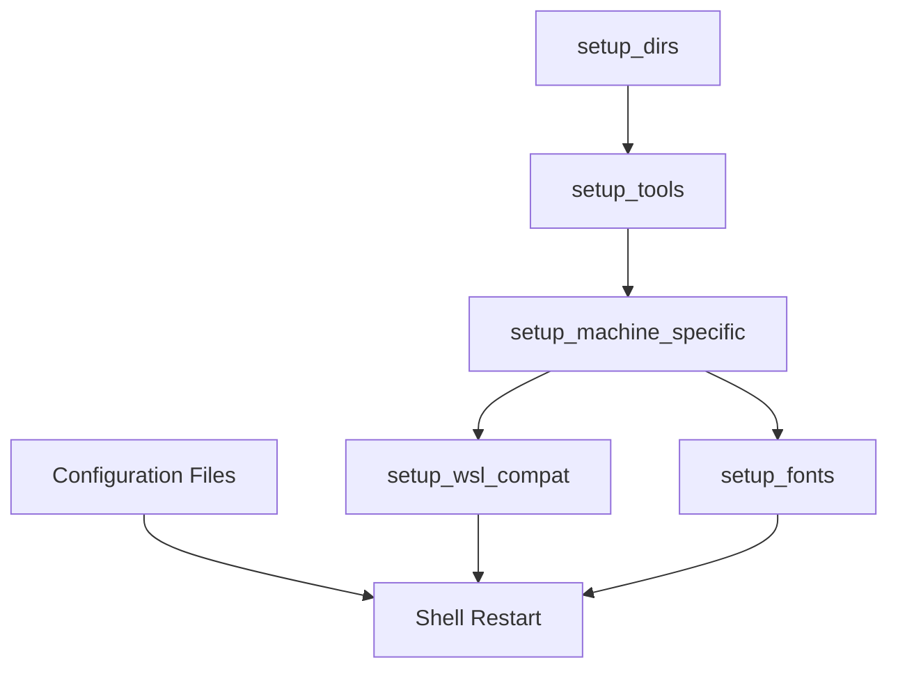

# Technical Architecture Deep Dive

This document provides an in-depth technical analysis of how our dotfiles system is architected, what manages what, and the reasoning behind design decisions. It serves as both a technical reference and documentation of architectural principles.

## Table of Contents

1. [System Overview](#system-overview)
2. [Orchestration Layer - ChezMoi](#orchestration-layer---chezmoi)
3. [Package Management - Pixi](#package-management---pixi)
4. [Shell Environment - Zsh + Zinit](#shell-environment---zsh--zinit)
5. [Configuration Management Architecture](#configuration-management-architecture)
6. [Tool Integration Patterns](#tool-integration-patterns)
7. [Machine-Specific Adaptation](#machine-specific-adaptation)
8. [Bootstrap Sequence Analysis](#bootstrap-sequence-analysis)
9. [Dependency Management](#dependency-management)
10. [Security and Isolation](#security-and-isolation)
11. [Performance Considerations](#performance-considerations)
12. [Troubleshooting Integration Points](#troubleshooting-integration-points)

---

## System Overview

### Architecture Philosophy

Our dotfiles system follows a **layered architecture** with clear separation of concerns:

```
┌─────────────────────────────────────────────────────────────┐
│                   User Experience Layer                     │
│  (Terminal, Prompt, Editor, Tools working together)        │
├─────────────────────────────────────────────────────────────┤
│                 Configuration Layer                         │
│     (Zsh configs, Tool configs, Machine adaptation)        │
├─────────────────────────────────────────────────────────────┤
│                  Tool Management Layer                      │
│              (Pixi environments, PATH management)           │
├─────────────────────────────────────────────────────────────┤
│                 Orchestration Layer                         │
│         (ChezMoi templating, deployment, updates)          │
├─────────────────────────────────────────────────────────────┤
│                  Foundation Layer                           │
│           (OS packages, System configuration)              │
└─────────────────────────────────────────────────────────────┘
```

### Core Principles

1. **Declarative over Imperative**: Configuration is declared in files, not scripts
2. **Reproducible Environments**: Same setup across different machines and time
3. **Minimal System Dependencies**: Most tools managed through package managers
4. **Machine Adaptation**: Automatic adjustment to different environments
5. **Modular Design**: Components are independent but work together seamlessly

---

## Orchestration Layer - ChezMoi

### What ChezMoi Manages

ChezMoi is our **configuration deployment engine** and serves as the single source of truth:

```
ChezMoi Repository (~/.local/share/chezmoi/)
├── Source Files (dot_*)          → Target Files (~/.*)
├── Templates (*.tmpl)            → Generated Configurations  
├── Scripts (run_once_*)          → Bootstrap Actions
├── Machine Detection             → Environment Adaptation
└── State Management              → Update Tracking
```

### Template System Architecture

ChezMoi's template system provides **dynamic configuration generation**:

```go-text-template
{{- /* Machine Type Detection */ -}}
{{- $machineType := "server" -}}
{{- if .chezmoi.kernel.osrelease | lower | contains "microsoft" -}}
{{-   $machineType = "wsl2" -}}
{{- else if stat "/usr/bin/gnome-session" -}}
{{-   $machineType = "ubuntu" -}}
{{- end -}}

# Generated configuration based on machine type
export DOTFILES_MACHINE_TYPE="{{ $machineType }}"
```

### Why ChezMoi Over Alternatives

| Aspect | ChezMoi | Ansible | Stow | Custom Scripts |
|--------|---------|---------|------|----------------|
| **Templating** | ✅ Built-in | ✅ Jinja2 | ❌ None | 🔶 Custom |
| **Secrets** | ✅ Encrypted | ✅ Vault | ❌ None | 🔶 Custom |
| **Machine Detection** | ✅ Automatic | 🔶 Manual | ❌ None | 🔶 Custom |
| **State Management** | ✅ Tracked | ✅ Tracked | 🔶 Limited | ❌ None |
| **Complexity** | 🟢 Low | 🔴 High | 🟢 Low | 🔶 Variable |

### ChezMoi Operation Modes

1. **Template Processing**: `{{ .chezmoi.* }}` variables provide system context
2. **Conditional Logic**: `{{- if eq .chezmoi.os "linux" -}}` for platform-specific config
3. **File Generation**: `dot_` prefix mapping to `~/.` in home directory
4. **Script Execution**: `run_once_*` scripts execute on first apply
5. **Diff Management**: Track changes between repository and deployed files

---

## Package Management - Pixi

### Why Pixi Over Traditional Package Managers

Pixi provides **reproducible package management** with several advantages:

| Feature | Pixi | apt/yum | Homebrew | Conda |
|---------|------|---------|----------|-------|
| **Reproducibility** | ✅ Lock files | ❌ Version drift | 🔶 Formulae | 🔶 Envs |
| **Isolation** | ✅ Per-project | ❌ System-wide | ❌ System-wide | ✅ Environments |
| **Cross-Platform** | ✅ Linux/macOS | ❌ OS-specific | ✅ Linux/macOS | ✅ Multi-platform |
| **Tool Ecosystem** | ✅ conda-forge | 🔶 OS packages | ✅ Large | ✅ Scientific |
| **Performance** | ✅ Fast | ✅ Fast | 🔶 Slower | 🔶 Slower |

### Pixi Environment Architecture

Our Pixi configuration uses **feature-based environments**:

```toml
# Feature Definition (Tools by Category)
[feature.default.dependencies]
fzf = "*"                # Core navigation tools
ripgrep = "*"
bat = "*"

[feature.dev.dependencies]  
git-delta = "*"          # Development-specific tools
gh = "*"

[feature.server.dependencies]
screen = "*"             # Server administration tools

# Environment Composition (Features Combined)
[environments]
default = ["default"]                    # Minimal setup
dev = ["default", "dev"]                # Development workstation  
server = ["default", "server"]          # Server administration
wsl2-dev = ["default", "dev", "wsl2"]   # WSL2 development
```

### Tool Selection Criteria

Tools are chosen for Pixi management based on:

1. **Availability in conda-forge**: Ensures cross-platform compatibility
2. **Version Stability**: Tools with stable release cycles
3. **Binary Distribution**: Avoids compilation during installation
4. **Update Frequency**: Balance between features and stability

**Fallback Strategy** for tools not in conda-forge:
- System package managers (apt, yum, dnf) for OS-specific tools
- Cargo for Rust tools (gum, lazydocker, vipe)
- Direct downloads for special cases

### PATH Management Strategy

```bash
# Priority Order (highest to lowest)
export PATH="$HOME/.pixi/bin:$HOME/.local/bin:$PATH"
#            ↑ Pixi tools    ↑ User scripts   ↑ System tools
```

This ensures:
1. **Pixi tools override system versions** (newer, consistent tools)
2. **User scripts take precedence** (custom automation)
3. **System tools remain available** (fallback compatibility)

---

## Shell Environment - Zsh + Zinit

### Shell Architecture Decision

**Zsh** was chosen over other shells for:

| Feature | Zsh | Bash | Fish | PowerShell |
|---------|-----|------|------|------------|
| **Compatibility** | ✅ POSIX + | ✅ POSIX | ❌ Different | ❌ Different |
| **Plugin Ecosystem** | ✅ Large | 🔶 Limited | 🔶 Growing | 🔶 Windows-focused |
| **Completion System** | ✅ Advanced | 🔶 Basic | ✅ Good | ✅ Good |
| **Performance** | ✅ Fast | ✅ Fast | 🔶 Slower | 🔶 Variable |
| **Customization** | ✅ Extensive | 🔶 Limited | ✅ Good | ✅ Good |

### Zinit Plugin Management

**Zinit** provides lazy loading and performance optimization:

```bash
# Performance-Optimized Loading
zinit wait lucid for \
  atinit"ZINIT[COMPINIT_OPTS]=-C; zicompinit; zicdreplay" \
    zdharma-continuum/fast-syntax-highlighting \
  blockf \
    zsh-users/zsh-completions \
  atload"!_zsh_autosuggest_start" \
    zsh-users/zsh-autosuggestions
```

**Loading Strategy**:
1. **Immediate**: Essential tools (Starship prompt)
2. **Lazy**: Enhancement plugins (`wait lucid`)
3. **Conditional**: Tool-specific plugins based on availability
4. **Modular**: Additional plugins in separate files

### Configuration Loading Order

The shell configuration follows a **dependency-aware loading sequence**:

```bash
# 1. Environment Setup
export PATH="$HOME/.pixi/bin:$HOME/.local/bin:$PATH"
export XDG_CONFIG_HOME="$HOME/.config"

# 2. Plugin Manager (Zinit)
source "${ZINIT_HOME}/zinit.zsh"

# 3. Core Prompt (Starship)
zinit ice as"command" from"gh-r" # ... starship setup

# 4. Essential Plugins (syntax highlighting, completions)
zinit wait lucid for # ... plugin loading

# 5. Tool Initialization (tools managed by Pixi)
command -v direnv >/dev/null && eval "$(direnv hook zsh)"
command -v zoxide >/dev/null && eval "$(zoxide init zsh)"

# 6. Configuration Modules (order matters)
source ~/.config/zsh/terminal-compat.zsh    # Platform compatibility
source ~/.config/zsh/machine-config.zsh     # Machine-specific settings
source ~/.config/zsh/aliases.zsh            # Global aliases
source ~/.config/zsh/local-aliases.zsh      # Machine-specific aliases
source ~/.config/zsh/completions.zsh        # Completion enhancements
source ~/.config/zsh/plugins.zsh            # Additional plugins

# 7. Custom Functions
for func in ~/.config/zsh/functions/*.zsh; do
  source "$func"
done
```

---

## Configuration Management Architecture

### Modular Configuration Design

Configuration is split into **logical modules** with clear responsibilities:

```
~/.config/zsh/
├── aliases.zsh              # Global command shortcuts
├── completions.zsh          # Tab completion enhancements  
├── machine-config.zsh       # Machine-specific settings
├── terminal-compat.zsh      # Cross-platform compatibility
├── plugins.zsh              # Additional Zinit plugins
├── local-aliases.zsh        # Machine-generated aliases
└── functions/               # Modular shell functions
    ├── gitlog.zsh          # Git logging utilities
    └── mkcd.zsh            # Directory creation shortcuts
```

### Configuration Hierarchy

```
Global Defaults
    ↓ (overridden by)
Machine Type Defaults (server/ubuntu/wsl2)
    ↓ (overridden by)  
Local Machine Overrides
    ↓ (overridden by)
User Runtime Changes
```

### File Naming Conventions

| Pattern | Purpose | Example |
|---------|---------|---------|
| `dot_*` | Dotfiles in home directory | `dot_vimrc` → `~/.vimrc` |
| `dot_config/*` | XDG config files | `dot_config/git/config` → `~/.config/git/config` |
| `*.tmpl` | Template files | `dot_zshrc.tmpl` → `~/.zshrc` |
| `run_once_*` | Bootstrap scripts | `run_once_setup_tools.sh.tmpl` |
| `local.*` | Machine-specific overrides | `local-aliases.zsh` |

---

## Tool Integration Patterns

### Integration Categories

Our tools integrate through several **well-defined patterns**:

#### 1. Shell Integration Pattern
```bash
# Tool Detection + Initialization
command -v toolname >/dev/null && eval "$(toolname init zsh)"

# Examples:
command -v direnv >/dev/null && eval "$(direnv hook zsh)"
command -v zoxide >/dev/null && eval "$(zoxide init zsh)"
command -v atuin >/dev/null && eval "$(atuin init zsh)"
```

#### 2. Configuration File Pattern  
```
Tool Config Location: ~/.config/tool/config
Integration Method: XDG Base Directory compliance
Management: ChezMoi template deployment
```

#### 3. Environment Variable Pattern
```bash
# Tool-specific environment variables
export EDITOR="nvim"           # Editor preference chain
export BROWSER="firefox"       # Browser for URL opening  
export PAGER="bat"            # Pager with syntax highlighting
```

#### 4. Alias Replacement Pattern
```bash
# Modern tool aliases replace traditional commands
alias ls='eza'                # Enhanced ls with git integration
alias cat='bat'               # Syntax-highlighted cat
alias find='fd'               # User-friendly find
alias grep='rg'               # Faster ripgrep
```

### Tool Interaction Matrix

| Tool | Integrates With | Integration Method | Purpose |
|------|----------------|-------------------|---------|
| **Starship** | Git, Pixi, Language detectors | Environment variables | Prompt information |
| **Git-Delta** | Git | Git config pager setting | Enhanced diffs |
| **Fzf** | Zsh, Git, Aliases | Key bindings + aliases | Fuzzy finding |
| **Bat** | Git, Less, Cat aliases | Environment + aliases | Syntax highlighting |
| **Eza** | Ls alias | Alias replacement | Enhanced file listing |
| **Ripgrep** | Grep alias, Fzf | Alias + tool integration | Fast text search |
| **Zoxide** | Cd command, Z alias | Shell hook integration | Smart directory jumping |

---

## Machine-Specific Adaptation

### Detection Architecture

Machine type detection uses a **cascading detection system**:

```bash
# Detection Priority Order
1. WSL2: Check $WSL_DISTRO_NAME environment variable
2. Ubuntu Desktop: Check for GNOME session + Ubuntu OS
3. Generic Server: Default fallback for other Linux systems
```

### Adaptation Mechanisms

#### 1. Template-Time Adaptation
```go-text-template
{{- if eq $machineType "server" }}
export EDITOR="vim"           # Lightweight for servers
export TMOUT=3600            # Security timeout
{{- else }}
export EDITOR="nvim"         # Full-featured for desktop/WSL2  
{{- end }}
```

#### 2. Runtime Adaptation
```bash
# Terminal compatibility detection
if [[ -n "$WSL_DISTRO_NAME" ]]; then
    # WSL2-specific clipboard integration
    alias pbcopy='clip.exe'
    alias pbpaste='powershell.exe Get-Clipboard'
elif [[ "$XDG_SESSION_TYPE" == "wayland" ]]; then
    # Wayland clipboard tools  
    alias pbcopy='wl-copy'
    alias pbpaste='wl-paste'
fi
```

#### 3. Package Installation Adaptation
```bash
# Machine-specific Pixi environments
case "$MACHINE_TYPE" in
    "wsl2")   pixi install --environment wsl2-dev ;;
    "ubuntu") pixi install --environment ubuntu-dev ;;  
    "server") pixi install --environment server ;;
esac
```

### Configuration Differences by Machine Type

| Aspect | Server | Ubuntu Desktop | WSL2 |
|--------|--------|----------------|------|
| **Editor** | vim (lightweight) | nvim (full-featured) | nvim + Windows integration |
| **Browser** | None | firefox | wslview (Windows) |
| **Clipboard** | Terminal only | xclip/wl-clipboard | Windows integration |
| **Security** | Timeouts, minimal tools | Standard desktop | Cross-platform considerations |
| **Tools** | System monitoring | Development + desktop | Development + Windows integration |

---

## Bootstrap Sequence Analysis

### Execution Order

The bootstrap process follows a **carefully orchestrated sequence**:

```
1. ChezMoi Installation (manual)
   ↓
2. Repository Clone (chezmoi init)
   ↓  
3. Template Processing (chezmoi apply)
   ↓
4. Bootstrap Scripts (run_once_*)
   ├── 4a. Machine Detection → Set environment type
   ├── 4b. Directory Setup → Create workspace structure  
   ├── 4c. Tool Installation → Install Pixi + environments
   ├── 4d. Font Installation → Download Nerd Fonts
   ├── 4e. Machine-Specific Setup → Configure for environment
   └── 4f. WSL Compatibility → WSL2-specific configuration
   ↓
5. Configuration Deployment (dot_* files)
   ├── 5a. Shell Configuration → ~/.zshrc, ~/.config/zsh/*
   ├── 5b. Tool Configurations → ~/.config/*/
   ├── 5c. Git Configuration → ~/.gitconfig, ~/.gitignore_global
   └── 5d. Editor Configurations → ~/.vimrc, ~/.config/nvim/
   ↓
6. Shell Restart → Load new configuration
   ↓
7. Tool Initialization → Shell hooks and integrations
```

### Script Dependencies



### Idempotency Guarantees

All bootstrap scripts are **idempotent** (safe to run multiple times):

1. **Existence Checks**: `[ ! -f file ] && create_file`
2. **Tool Detection**: `command -v tool >/dev/null || install_tool`
3. **Directory Creation**: `mkdir -p` (no error if exists)
4. **Package Installation**: Package managers handle already-installed packages
5. **Configuration Updates**: ChezMoi diffs prevent unnecessary changes

---

## Dependency Management

### Dependency Categories

Dependencies are managed at multiple levels:

#### 1. System Dependencies (Minimal)
```bash
# Required for bootstrap
- curl (ChezMoi installation)
- git (Repository cloning)
- bash/zsh (Script execution)

# Installed by setup scripts
- build-essential (Compilation tools) 
- Package manager (apt/yum/dnf)
```

#### 2. Pixi Dependencies (Managed)
```toml
# All CLI tools managed through conda-forge
# Automatic dependency resolution
# Version locking through pixi.lock
```

#### 3. Configuration Dependencies
```bash
# Configuration files depend on tools being available
# Graceful degradation when tools are missing
command -v tool >/dev/null && configure_tool
```

### Dependency Resolution Strategy

```
System Package Manager (OS packages)
    ↓ (provides base system)
Pixi (CLI tools from conda-forge)  
    ↓ (provides user tools)
Cargo/Go/Other (Specialized tools)
    ↓ (provides cutting-edge tools)
Configuration (Integrates everything)
```

### Circular Dependency Prevention

1. **Clear Hierarchy**: System → Tools → Configuration
2. **Optional Integration**: Tools work independently
3. **Graceful Degradation**: Missing tools don't break setup
4. **Late Binding**: Configuration loads tools when available

---

## Security and Isolation

### Security Principles

1. **Minimal Privileges**: No unnecessary sudo requirements
2. **User Space**: Everything in user directories when possible  
3. **Verified Sources**: Official repositories and signed packages
4. **Transparent Installation**: All sources documented and traceable

### Isolation Mechanisms

#### 1. User-Level Installation
```bash
# Pixi tools installed in user space
~/.pixi/bin/           # Pixi-managed binaries
~/.local/bin/          # User scripts
~/.local/share/        # User data
```

#### 2. Environment Isolation  
```bash
# Pixi provides isolated environments
pixi shell --environment dev     # Development tools only
pixi shell --environment server  # Server tools only
```

#### 3. Configuration Isolation
```bash
# XDG compliance keeps configurations separate
~/.config/tool/        # Tool-specific configurations
~/.local/share/tool/   # Tool-specific data
~/.cache/tool/         # Tool-specific cache
```

### Secret Management

For sensitive data (if needed in future):
```bash
# ChezMoi supports encrypted secrets
chezmoi add --encrypt secret_file
chezmoi edit --template secret_template.tmpl
```

---

## Performance Considerations

### Shell Startup Performance

Our configuration is optimized for **fast shell startup**:

#### 1. Lazy Loading Strategy
```bash
# Plugins load after prompt is ready
zinit wait lucid for \
  plugin1 \
  plugin2

# Tool initialization is conditional
command -v tool >/dev/null && eval "$(tool init zsh)"
```

#### 2. Compilation Caching
```bash
# Zinit compiles functions for faster loading
ZINIT[COMPINIT_OPTS]=-C
zicompinit
zicdreplay
```

#### 3. Async Loading
```bash
# Heavy operations happen in background
zinit wait"2" lucid for heavy-plugin
```

### Tool Performance

| Tool | Performance Benefit | Traditional Alternative |
|------|-------------------|----------------------|
| **Ripgrep** | 10-100x faster | grep |
| **Fd** | 5-10x faster | find |
| **Bat** | Syntax highlighting | cat |
| **Eza** | Git integration | ls |
| **Zoxide** | Learning algorithm | cd |

### Memory Usage

```bash
# Optimizations for memory usage:
1. Lazy plugin loading (plugins load when needed)
2. Efficient history management (deduplication)
3. Minimal plugin set (only essential plugins)
4. Tool efficiency (modern tools use less memory)
```

---

## Troubleshooting Integration Points

### Common Integration Issues

#### 1. PATH Problems
```bash
# Diagnosis
echo $PATH | tr ':' '\n'   # Check PATH order
which tool                 # Check tool location
type tool                  # Check if aliased

# Solutions
export PATH="$HOME/.pixi/bin:$PATH"  # Ensure Pixi priority
```

#### 2. Plugin Loading Issues
```bash
# Diagnosis  
zinit report plugin-name   # Check plugin status
zinit times               # Check loading times

# Solutions
zinit delete plugin-name && zinit load plugin-name  # Reload plugin
```

#### 3. Tool Integration Failures
```bash
# Diagnosis
command -v tool >/dev/null && echo "Available" || echo "Missing"

# Solutions
pixi install              # Reinstall Pixi environment
chezmoi apply            # Reapply configurations
```

#### 4. Template Processing Errors
```bash
# Diagnosis
chezmoi execute-template < template.tmpl  # Test template

# Solutions  
chezmoi diff             # Check pending changes
chezmoi apply --dry-run  # Preview changes
```

### Diagnostic Commands

```bash
# System health check
chezmoi doctor           # ChezMoi configuration check
pixi info               # Pixi environment status
zinit times             # Shell startup performance

# Tool availability
which -a tool           # All versions of tool
type tool              # How tool is resolved
command -v tool        # Tool existence check

# Configuration validation
zsh -n ~/.zshrc        # Syntax check
starship config        # Prompt configuration check
```

### Recovery Procedures

#### 1. Complete Reset
```bash
# Remove all configurations
rm -rf ~/.config/zsh ~/.local/share/zinit ~/.pixi
# Reapply from ChezMoi
chezmoi apply
```

#### 2. Partial Reset  
```bash
# Reset specific component
rm -rf ~/.local/share/zinit && source ~/.zshrc  # Reset plugins
pixi clean && pixi install                      # Reset tools
```

#### 3. Safe Mode
```bash
# Start with minimal configuration
zsh --no-rcs           # Skip all configurations  
bash                   # Use bash instead
```

---

## Conclusion

This architecture provides a **robust, maintainable, and performant** dotfiles system that:

1. **Scales** from minimal server installs to full development workstations
2. **Adapts** automatically to different machine types and environments  
3. **Maintains** consistency while allowing customization
4. **Performs** efficiently with lazy loading and optimized tools
5. **Troubleshoots** easily with clear component separation
6. **Evolves** gracefully as new tools and requirements emerge

The modular design and clear separation of concerns ensure that each component can be understood, modified, and maintained independently while contributing to a cohesive whole.
